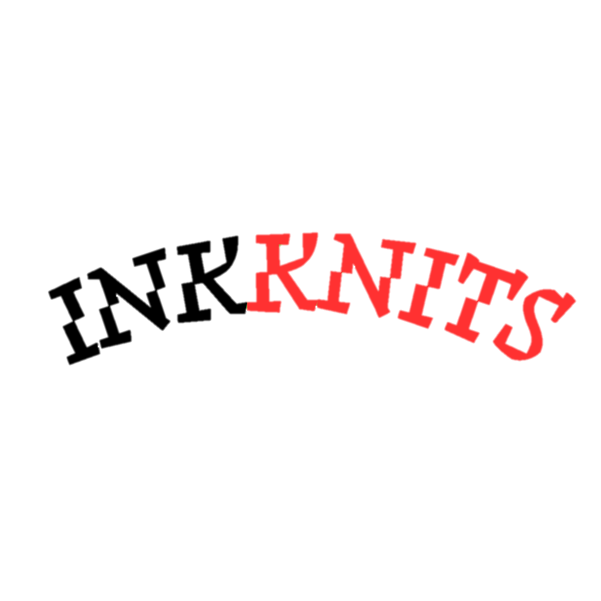

# InkKnits



InkKnits is a FastAPI + SQLAlchemy backend for managing organization, project, station, asset, version, approval, and AI workflows.

## What’s included
- Authentication with role-based access control
- Asset management with upload validation and version tracking
- AI job scheduling and approval workflows
- Activity logging and structured storage
- API contract and frontend directives in `docs/`

## Quick start
1. Open `backend/`
2. Create and activate a Python virtual environment
3. Install dependencies:
   ```bash
   pip install -r backend/requirements.txt
   ```
4. Start the API:
   ```bash
   uvicorn backend.app.main:app --reload
   ```

## Docs
- `docs/API_CONTRACT.md`
- `docs/FRONTEND_DIRECTIVES.md`
- `docs/phase10audit2.md`
- `docs/PROJECT_BIBLE.md`

## Notes
Keep environment secrets out of source control and use the backend `backend/requirements.txt` for Python dependencies.